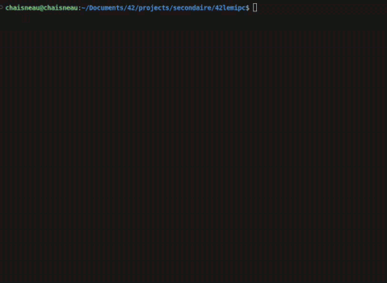

# 42lemipc

Simple multi‑process arena using System V IPC (shared memory, semaphores, messages).
Each player is its own process, belongs to a team, and moves on a grid; a
displayer renders the board in the terminal. Goal: teams coordinate via IPC to
outnumber/eliminate opponents until one team remains.

  

**Game Logic**
- **Map:** 30×30 grid; `EMPTY_TILE` marks free cells. Each player uses a unique team symbol.
- **Turns/Locking:** A single process‑shared semaphore (`semGame`) serializes map updates. Players acquire, move, then release; the displayer only reads.
- **Movement:** 1 cell per tick into empty cells. The AI heads toward a shared team target via SysV message queue or the nearest enemy, avoiding high‑risk squares.
- **Elimination:** A player dies when it has two or more adjacent enemies in the 8‑neighbor ring; on death, its tile is cleared.
- **Start:** The displayer starts the match and prevents late joins once running; players spawn on random empty cells before start.
- **End Conditions:** Game ends on an explicit quit, when `playersAlive <= 2`, or when the board contains pieces from a single team.
- **Cleanup:** The last exiting player removes the message queue and marks shared memory for deletion; existing attachments remain valid until processes detach/exit.
- **Display:** Unlocked reads for speed; brief tearing may occur and is acceptable.

Build & Run
- Build: `make`
- Quick start (spawns players then the displayer): `./launch.py <teams> <players_per_team>`
  - Example: `./launch.py 3 4`
- Manual run:
  - Displayer: `./main.out`
  - Player (AI): `./main.out X` where `X` is the team symbol (e.g. `1`, `A`).

Makefile (basics)
- `all`: default target; ensures submodules are ready, builds `main.out`.
- `clean`: removes object files.
- `fclean`: also removes `main.out`.
- `re`: full rebuild (equivalent to `fclean` then build).

Test (basics)
- `python3 test/test_ipc_cleanup.py`: Verify shared memory segment and msg queue is well destroyed.
- `python3 test/test_valgrind.py`: launch a 2 team 2 player game with valgrind (terminal popup).

Notes
- Team symbols used by the launcher start at `1-9`, then `A-Z`, then `a-z`.
- Limit: total players must be `teams * players_per_team <= MAX_PLAYER` defined in `srcs/include/main.h`.
